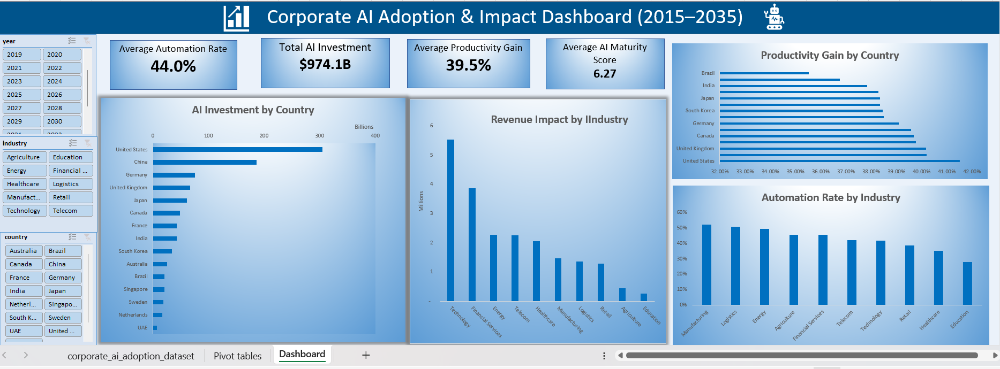

# Corporate AI Adoption & Impact Dashboard (2015–2035)

## Project Objective

Analyze AI adoption trends across countries and industries to understand investment patterns, productivity improvements, automation levels, and revenue impact.

## Tools Used

- Microsoft Excel
- Pivot Tables
- Pivot Charts
- Slicers
- Dashboard Design

## KPIs

- Average Automation Rate
- Total AI Investment
- Average Productivity Gain
- Average AI Maturity Score

## Business Questions

- Which country has invested the most in AI?
- Which industry generates the highest revenue impact?
- Which countries experience the highest productivity gains?
- Which industries have the highest automation rates?
- How do AI adoption trends change across years?

## Process

- Data cleaning and validation
- Pivot table creation
- KPI calculation
- Interactive dashboard development
- Slicer integration for dynamic filtering

## Dashboard

## Key Insights

- United States leads AI investment.
- Technology industry generates the highest revenue impact.
- Manufacturing shows the highest automation rate.
- Countries with higher AI maturity scores tend to experience stronger productivity gains.

## Conclusion

Organizations investing strategically in AI show measurable gains in productivity, automation, and revenue generation. Technology-driven sectors continue to lead AI adoption globally.
